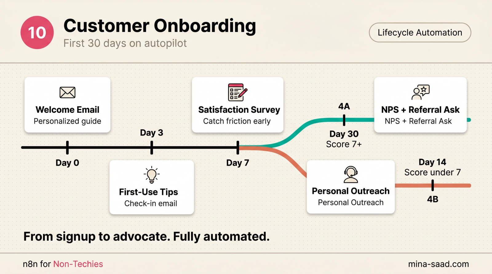

# n8n Customer Onboarding

    

> Stop relying on your memory and a Notion checklist for new-customer onboarding. A webhook-triggered n8n workflow runs the same 30-day sequence for every customer: welcome, check-in, friction survey, human touchpoint, NPS plus referral ask.

> Part of the **[n8n-ai-agents catalog](https://github.com/MinaSaad1/n8n-ai-agents)**, see the catalog for shared [architecture principles](https://github.com/MinaSaad1/n8n-ai-agents/blob/main/docs/architecture-principles.md), [security framework](https://github.com/MinaSaad1/n8n-ai-agents/blob/main/docs/security-framework.md), and [output conventions](https://github.com/MinaSaad1/n8n-ai-agents/blob/main/docs/output-conventions.md) every template in the collection follows.



---

## What it does

- Fires the moment a new customer is created in your CRM or pays through Stripe
- Sends a Day 0 welcome email immediately, with setup steps you control
- Sends a Day 3 check-in with first-week tips
- Sends a Day 7 friction survey ("on a scale of 1-10, how likely are you to keep using this?")
- Flags a human touchpoint internally on Day 14 so the personal reach-out actually happens
- Sends a Day 30 NPS plus referral ask, branchable on score
- Every email is template-driven, every wait is configurable, every branch is yours to wire

## Architecture

```
Webhook (CRM or Stripe customer.subscription.created)
        |
        v
Extract Customer Data  (Set node, pulls name/email/company/plan)
        |
        +--> Webhook Response (200 OK back to caller)
        |
        v
Day 0 Welcome Email  (Gmail send)
        |
        v
Wait 3 Days
        |
        v
Day 3 Check-in Email
        |
        v
Wait 4 More Days
        |
        v
Day 7 Friction Survey
        |
        v
Wait 7 More Days
        |
        v
Day 14 Flag for Human Touch  (internal email to you, not the customer)
        |
        v
Wait 16 More Days
        |
        v
Day 30 NPS plus Referral
```

Twelve nodes plus a sticky README. Webhook in, Gmail out, Wait nodes between each touchpoint. The Day 14 step is intentionally an internal alert, not another automated email, because the personal moment has to come from you.

See [`docs/ARCHITECTURE.md`](docs/ARCHITECTURE.md) for the full component breakdown and the honest discussion of Wait-node reliability for multi-week timers.

## Requirements

- **n8n** >= 1.78 (cloud or self-hosted)
- **Gmail** (or any send-email node, Resend / SMTP / SendGrid all work with a small swap)
- **A webhook source**: HubSpot, Salesforce, Airtable, Stripe, or anything that can POST JSON
- **Optional**: Notion for the Day 14 task instead of an internal email
- **Optional**: Typeform / Tally / Google Forms for structured Day 7 survey responses
- **Optional**: Claude / OpenRouter API key if you want personalized email copy per customer

## Quickstart

### 1. Clone

```bash
git clone https://github.com/MinaSaad1/n8n-customer-onboarding.git
cd n8n-customer-onboarding
```

### 2. Decide on the webhook source

Most common: a CRM or billing webhook fires when a customer is created or pays. Examples:

- **Stripe**: `customer.subscription.created` event hits the webhook URL
- **HubSpot**: workflow action "send webhook" on the "new customer" lifecycle stage
- **Airtable**: automation that POSTs when a new row lands in a "Customers" table
- **Manual**: a curl call you fire from a form or signup endpoint

The workflow expects a JSON body with at minimum `name`, `email`, and optionally `company`, `plan`. See [`docs/SETUP.md`](docs/SETUP.md) for payload examples per source.

### 3. Import the workflow into n8n

1. n8n, **Workflows**, **Import from File**
2. Select [`workflows/01-customer-onboarding.json`](workflows/01-customer-onboarding.json)
3. Open the imported workflow

### 4. Create credentials

| Node | Credential | Notes |
|---|---|---|
| `Day 0 Welcome Email`, `Day 3 Check-in Email`, `Day 7 Friction Survey`, `Day 14 Flag for Human Touch`, `Day 30 NPS plus Referral` | Gmail OAuth2 | All five Gmail nodes share one credential. Connect once. |
| Optional: Notion node for Day 14 | Notion API token | If you swap the internal email for a Notion task. |
| Optional: Claude / OpenRouter | API key | For per-customer personalized copy via HTTP node. |

### 5. Customize the email templates

Open each `Day N` node and edit the `subject` and `message` fields. The placeholders `{{ $json.name }}`, `{{ $json.email }}`, `{{ $json.company }}`, `{{ $json.plan }}`, and `{{ $json.sender_name }}` come from the **Extract Customer Data** Set node. Edit `sender_name` there once, and it propagates.

The defaults are deliberately plain text and short. Replace `[STEP 1]`, `[TIP 1]`, `[PRODUCT]` placeholders with your actual content. See [`docs/SETUP.md`](docs/SETUP.md) for the full list of edit points.

### 6. Set up the Day 14 internal alert

The default behavior emails YOUR_NAME@YOUR_DOMAIN.com when Day 14 fires. Edit the `sendTo` field on `Day 14 Flag for Human Touch` to your real address, or swap the node for a Notion task / Slack message. The point: don't let Day 14 become another automated email to the customer. That's where personal contact has to live.

### 7. Test once, then activate

Hit the webhook URL with a test payload (curl example in [`docs/SETUP.md`](docs/SETUP.md)). Watch the Day 0 email arrive at the test address. Then either let it run the real 30-day timer or shorten the Wait nodes for testing.

## Configuration

- **Different sequence length**: edit the `amount` field on each Wait node. Days 3, 4, 7, 16 = 30 days total. Want a 14-day flow? Compress the waits.
- **Different email provider**: swap the Gmail nodes for `Send Email` (SMTP), Resend, SendGrid, or Mailgun. The expressions stay the same.
- **Branch on Day 7 survey score**: the template sends the survey but doesn't capture responses inline (replies are unstructured). Wire Typeform or Tally as a separate webhook-triggered workflow that updates a customer record, then read that record on Day 14. See [`docs/SETUP.md`](docs/SETUP.md).
- **Branch on Day 30 NPS**: same pattern. Use a structured survey tool. Score >= 9 = promoter route (referral ask, case study request). Score <= 6 = detractor route (CSM call, save offer).
- **Personalize copy with Claude**: insert an HTTP Request node before each Gmail node that POSTs to OpenRouter with the customer's name/company/plan and returns a customized message body. Cost: roughly 1 USD per 1000 customers on Claude Sonnet via OpenRouter.
- **Use Notion instead of email for Day 14**: replace the Day 14 Gmail node with a Notion "Create page" node that creates a task in your team's task DB.

## Troubleshooting

| Symptom | Cause | Fix |
|---|---|---|
| Webhook fires but Day 0 email never sends | Gmail credential not authorized for send scope | Reconnect with `https://www.googleapis.com/auth/gmail.send` scope. |
| Day 3 / Day 7 emails never fire | n8n instance restarted between waits | Wait nodes lose state on restart. See [`docs/SETUP.md`](docs/SETUP.md) for the absolute-time scheduling fallback. |
| Welcome email lands in spam | Gmail send from a non-domain-verified account | Move to Resend or SendGrid with a verified domain and DKIM/SPF/DMARC. Plain-text emails deliver better than image-heavy HTML. |
| Customer unsubscribed but still receiving | No suppression check in the flow | Add an Airtable / database lookup at the top of each Day node that exits if `unsubscribed = true`. |
| Stripe webhook delivers events the workflow rejects | Signature verification not implemented | Add an HTTP-validating Code node or use a reverse proxy. See [`docs/SECURITY.md`](docs/SECURITY.md). |
| Day 14 internal email goes to a teammate who's left | Hardcoded address in the node | Read the on-call from a Notion DB or env var, not the workflow JSON. |

## Security

Five things matter for this workflow:

1. **Webhook signature verification**, especially Stripe. Anyone with the webhook URL can spoof customer events otherwise.
2. **Email deliverability**, sending welcome sequences from an unverified domain flags inbox providers fast.
3. **Wait-node reliability**, n8n restarts kill in-flight Wait timers. For production with multi-week sequences, use absolute-time scheduling.
4. **PII in customer data**, the workflow handles names, emails, company, plan. Don't log it loosely.
5. **NPS / survey response privacy**, free-text survey replies often contain frustrated quotes. Treat them as confidential.

Full threat model and layered defenses in [`docs/SECURITY.md`](docs/SECURITY.md).

## Roadmap

- [ ] Drop-in absolute-time scheduling sub-workflow (replaces Wait nodes for production)
- [ ] Typeform / Tally response handler as a sibling workflow
- [ ] Per-plan branching example (suppress upsells on free plan)
- [ ] Claude personalization HTTP node as a sub-workflow
- [ ] Slack-instead-of-email variant for the Day 14 internal flag

## License

MIT, see [LICENSE](LICENSE).

## Credits

Built by [Mina Saad](https://github.com/MinaSaad1). Part of the [n8n-ai-agents catalog](https://github.com/MinaSaad1/n8n-ai-agents).

---

## Need this running in your business?

This template is free and MIT, and it is meant to be forked. Getting one into
production against your real data, your credentials and your edge cases is a
different job, and it is the one I do.

I work out what is actually costing a business, then build whatever fixes it: an
AI agent, an automation, or a full application. Handed over so your team owns it.

[Book a call](https://cal.com/minasaad/60min) · [mina-saad.com](https://www.mina-saad.com)
